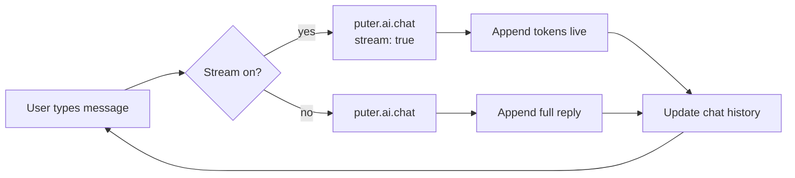

<!-- ===================== HEADER ===================== -->
<div align="center">


<br/><br/>

<!-- Badges -->


<br/>


</div>

<!-- ===================== DEMO ===================== -->
<div align="center">

### ✨ Demo

<!-- 👉 Drop a screen-recording GIF at docs/demo.gif to show it live -->


</div>

---

## 🪄 Overview

**Nova Chat** is a clean, minimal AI chatbot built with **React + Vite** on top of [**Puter.js**](https://docs.puter.com).
One `<script>` tag gives you access to **500+ AI models** — OpenAI, Anthropic, Google, xAI, Mistral, DeepSeek and more — with **no API keys, no backend, and no infra bills**.

> 💡 **User-pays model:** each end-user signs in with their free Puter account and pays only for their own usage beyond the free tier. You ship AI for **$0** infrastructure cost.

---

## 🚀 Features

| | Feature | Description |
|:--:|:--|:--|
| 🤖 | **500+ Models** | Auto-loaded dropdown with search from `puter.ai.listModels()` |
| 🌊 | **Live Streaming** | Tokens stream in real time — toggle on/off |
| 🧠 | **Multi-turn Memory** | Full conversation context sent each turn |
| 🎯 | **Haiku by Default** | Smart-picks the best Claude Haiku model on load |
| 🎨 | **Glassmorphism UI** | Frosted glass composer, gradient accents, smooth animations |
| 🔑 | **No API Key** | Powered entirely by Puter.js |
| 💾 | **Chat Persistence** | Messages survive page refresh via localStorage |
| 🆕 | **New Chat** | Start fresh conversations without losing history |
| 📜 | **Scroll-to-Bottom** | Floating button appears when scrolled up |
| 🌗 | **Dark / Light Theme** | Toggle with persisted preference |
| 🔐 | **Puter Auth** | Sign in/out with Puter account, user avatar in header |
| 📱 | **Responsive** | Works on desktop & mobile |

<div align="center">

</div>

---

## 🛠️ Tech Stack

<div align="center">


</div>

- **React 18** — UI with modular component architecture
- **Vite 5** — dev server + build
- **Puter.js v2** — AI, auth, billing (CDN)
- **Vanilla CSS** — design system with glassmorphism, gradients, animations
- **LocalStorage** — chat history & settings persistence

---

## 📦 Getting Started

```bash
# 1. Install dependencies
npm install

# 2. Start the dev server
npm run dev

# 3. Open the app
#    http://localhost:5173  (Vite auto-bumps the port if taken)
```

> ⚠️ **Must be served over HTTP** (Vite handles this) — Puter.js will not run from a `file://` URL.

### Build for production

```bash
npm run build      # → dist/
npm run preview    # preview the production build
```

---

## 🧩 How It Works



On the first message, Puter shows a **one-time login popup** (free account) to attach usage to the user — then replies stream in.

---

## 📁 Project Structure

```
Puter/
├── index.html                # Vite entry + Puter.js <script>
├── vite.config.js            # Vite + React config
├── postcss.config.js         # CSS isolation
├── package.json
└── src/
    ├── main.jsx              # React mount
    ├── App.jsx               # State management, AI integration, keyboard shortcuts
    ├── utils.js              # formatTime, parseThinking, downloadChat helpers
    ├── index.css             # Full design system (themes, glassmorphism, animations)
    └── components/
        ├── Header.jsx               # Brand, new chat, theme toggle, settings
        ├── ChatArea.jsx             # Scrollable message list with auto-scroll
        ├── Message.jsx              # Individual message bubble (user, AI, error, actions)
        ├── Composer.jsx             # Textarea input with send/stop buttons
        ├── SettingsDrawer.jsx       # Slide-in panel for all settings
        ├── WelcomeScreen.jsx        # Animated landing with prompt suggestions
        ├── ScrollToBottom.jsx       # Floating scroll-to-bottom button
        ├── AiMessageWithThinking.jsx# Collapsible <thinking> tag renderer
        └── MarkdownRenderer.jsx     # Syntax-highlighted code blocks + markdown
```

---

## ⚙️ Core API

```js
// List all models for the dropdown
const models = await puter.ai.listModels();

// Chat with streaming
const resp = await puter.ai.chat(messages, {
  model: 'claude-haiku-4-5',
  stream: true,
});
for await (const part of resp) {
  console.log(part?.text);
}
```

---

## 🗺️ Roadmap

- [x] Markdown + code-block rendering of replies
- [x] Light / dark theme toggle
- [x] Persist chat history (localStorage)
- [x] Message timestamps & avatars
- [x] New chat & conversation management
- [x] Glassmorphism UI with animations
- [x] Header sign-in button with Puter auth (sign in/out, user avatar)
- [ ] Image input (vision models)
- [ ] Multiple conversation threads

---

<!-- ===================== FOOTER ===================== -->
<div align="center">


### Powered by [Puter](https://developer.puter.com) ✦

<sub>Built with React + Vite • MIT License</sub>


</div>
